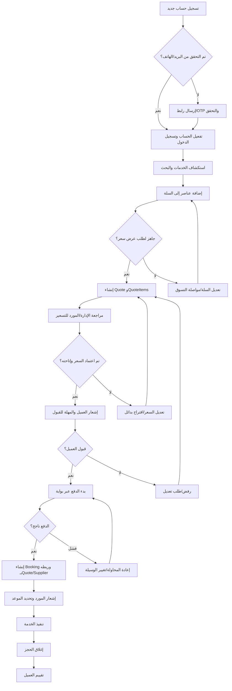
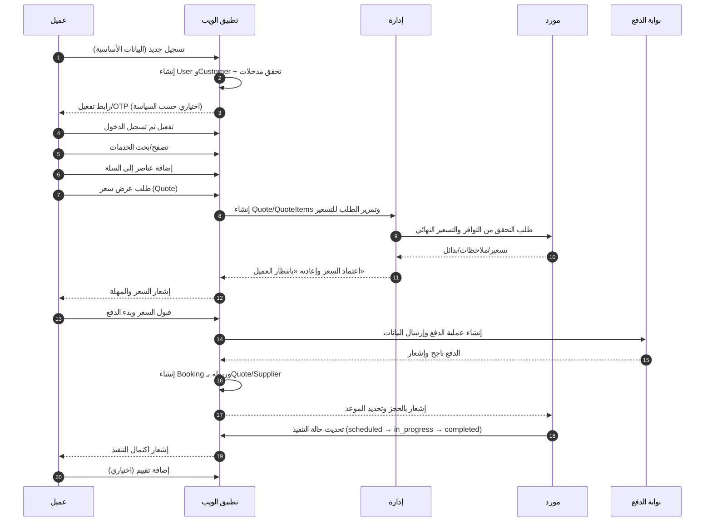

# رحلة العميل من التسجيل لأول مرة حتى تنفيذ الطلب (Your Events)

هذا المستند يصف بالتفصيل كيفية عمل الموقع من منظور العميل منذ لحظة التسجيل لأول مرة، مرورًا بإنشاء طلب عرض سعر والدفع، وحتى تنفيذ الخدمة وإغلاق الحجز. تمت صياغته ليكون قابلًا لإعادة الاستخدام على مواقع أخرى كمرجع لبناء مخطط UGD (User Journey Diagram) شامل.

## نظرة عامة
- الأدوار: عميل، إدارة، مورد، بوابة الدفع.
- الكيانات الأساسية: `User`/`Customer`، `Service`/`ServiceVariation`، `CartItem`، `Quote`/`QuoteItem`، `Booking`، `Supplier`، `Order` (اختياري)، `Review`.
- حالات رئيسية: حالات عرض السعر (`draft` → `pending_customer` → `accepted`/`rejected`)، حالات الحجز (`pending` → `scheduled` → `in_progress` → `completed`/`cancelled`).
- تحقق الحساب للعميل: بريد/OTP اختياري حسب سياسة الموقع (في Your Events يوجد OTP للمورد، ويمكن جعل تحقق البريد للعميل اختياريًا).

## رحلة العميل بالتفصيل
1) التسجيل لأول مرة
   - يزور العميل صفحة التسجيل ويُدخل بياناته الأساسية (اسم، بريد، هاتف، كلمة مرور).
   - التحقق من صحة المدخلات، إنشاء سجل `User` وربطه بـ`Customer`، تسجيل نشاط الدخول الأول.
   - إن كانت سياسة الموقع تتطلب تحقق بريد/OTP، يُرسل رابط التفعيل أو كود OTP ويتم التحقق قبل السماح بالدخول الكامل.

2) تفعيل الحساب وتسجيل الدخول
   - بعد التفعيل، يُجري العميل تسجيل الدخول.
   - تُنشأ جلسة آمنة، ويُحمَّل أي سياق سابق (مثل عناصر سلة مجهولة إن وُجدت) ويُربط بحساب العميل.

3) استكشاف الخدمات والبحث
   - يتصفح العميل الأقسام والفئات ويبحث عن الخدمات المناسبة (فلترة، ترتيب، تفاصيل الخدمة/التباينات).
   - يعرض الموقع تفاصيل التسعير الأساسي، الخيارات الإضافية، الصور والتقييمات.

4) إضافة العناصر إلى السلة
   - يحدد العميل التباين/الخيار ويضيفه إلى السلة (ينشأ `CartItem` مرتبط بـ`Service`/`ServiceVariation`).
   - يمكن تعديل الكميات، إضافة/حذف عناصر، ومراجعة المجموعات المؤقتة والضرائب/الرسوم إن لزم.

5) طلب عرض سعر من السلة
   - عند جاهزية العميل، يطلب «عرض سعر» للسلة الحالية.
   - ينشأ `Quote` مع `QuoteItem` لكل عنصر، تُجمع الحقول (التواريخ، الموقع، عدد الضيوف، ملاحظات خاصة).
   - يُرسل الطلب للإدارة/الموردين المعنيين للتسعير النهائي أو التحقق من التوافر.

6) تسعير الإدارة/المورد واعتماد السعر
   - تقوم الإدارة بمراجعة الطلب وقد تستشير المورد لتحديد سعر نهائي وتوافر.
   - تُعاد حالة الـ`Quote` إلى «بانتظار العميل» مع تفاصيل السعر والمهلة الزمنية للقبول.
   - يتسلم العميل إشعارًا ويستعرض العرض: القبول، الرفض، أو طلب تعديل.

7) الدفع وإنشاء الحجز
   - إذا قبل العميل السعر، يبدأ الدفع عبر بوابة معتمدة (بطاقة/تحويل/محفظة).
   - عند نجاح الدفع، ينشأ `Booking` مرتبط بالـ`Quote` والمورد، ويُحدَّد الموعد.
   - تُرسل الإشعارات للعميل والمورد، وتنتقل حالة الحجز إلى «مجدول».

8) تنفيذ الخدمة وإغلاق الحجز
   - يوم التنفيذ، يُحدِّث المورد الحالة إلى «جار التنفيذ»، ثم «مكتمل» بعد الانتهاء.
   - قد يُنشأ `Order`/فاتورة ختامية إن كان النظام يتطلب ذلك.
   - يُشجَّع العميل على ترك تقييم (`Review`) وإغلاق الحجز نهائيًا.

9) الفروع والأخطاء الشائعة
   - فشل الدفع: يُعرض خيار إعادة المحاولة أو اختيار وسيلة أخرى.
   - رفض السعر أو انتهاء المهلة: يُعاد الطلب للتعديل أو يُغلق العرض.
   - عدم توافر المورد: يُقترح موعد بديل أو مورد بديل قبل الدفع.

---

## مخطط تدفق شامل (Mermaid Flowchart)


## مخطط تسلسل رحلة العميل (Mermaid Sequence)


## حالات الكيانات الرئيسية (موجز عملي)
- Quote: `draft` → `awaiting_supplier/admin` → `pending_customer` → `accepted`/`rejected` → `closed`.
- Booking: `pending` → `scheduled` → `in_progress` → `completed`/`cancelled`.
- Payment: `initiated` → `authorized`/`captured` → `failed` (إعادة المحاولة) → `refunded` (اختياري).

## نقاط تكامل ونصائح إعادة الاستخدام (UGD على موقع آخر)
- اعتمد نفس التسلسل العام؛ غيّر التسميات والكيانات حسب نظامك.
- اجعل تحقق الحساب قابلاً للتهيئة (بريد/OTP/بلا تحقق للعميل وفق السياسة).
- اربط طلب العرض بالسلة الحالية لتحسين الدقة وتسهيل الإنشاء الآلي لـ`QuoteItem`.
- افصل اعتماد التسعير عن الدفع؛ لا تنشئ `Booking` إلا بعد الدفع الناجح.
- وفّر مهلة زمنية لقبول العرض من العميل وبدائل عند عدم التوافر.
- استخدم إشعارات واضحة في كل انتقال حالة (عميل/مورد/إدارة).

## كيفية العرض/التصدير
- يمكنك عرض المخططات مباشرة في منصات تدعم Mermaid (مثل GitHub/Docs).
- للتصدير إلى صور PNG/SVG: استخدم Mermaid CLI (`mmdc`) أو إضافات VS Code.
- انسخ الكتل بين علامات "```mermaid" إلى أي موقع يدعم Mermaid لإنشاء مخطط UGD مماثل.

## ملاحظات التوافق مع Your Events
- تتوافق هذه الرحلة مع الكيانات الموجودة: `Quote`, `QuoteItem`, `Booking`, `Service`, `Supplier`, `Customer`.
- تدفق الدفع مرتبط بعرض السعر كما هو موثق في الملفات: QUOTE_PAYMENT_SYSTEM.md و PAYMENT-GATEWAYS-GUIDE.md.
- تحقق OTP مفعل للموردين (انظر OTP-*.md). تحقق العميل اختياري ويمكن تمكينه كبريد.

