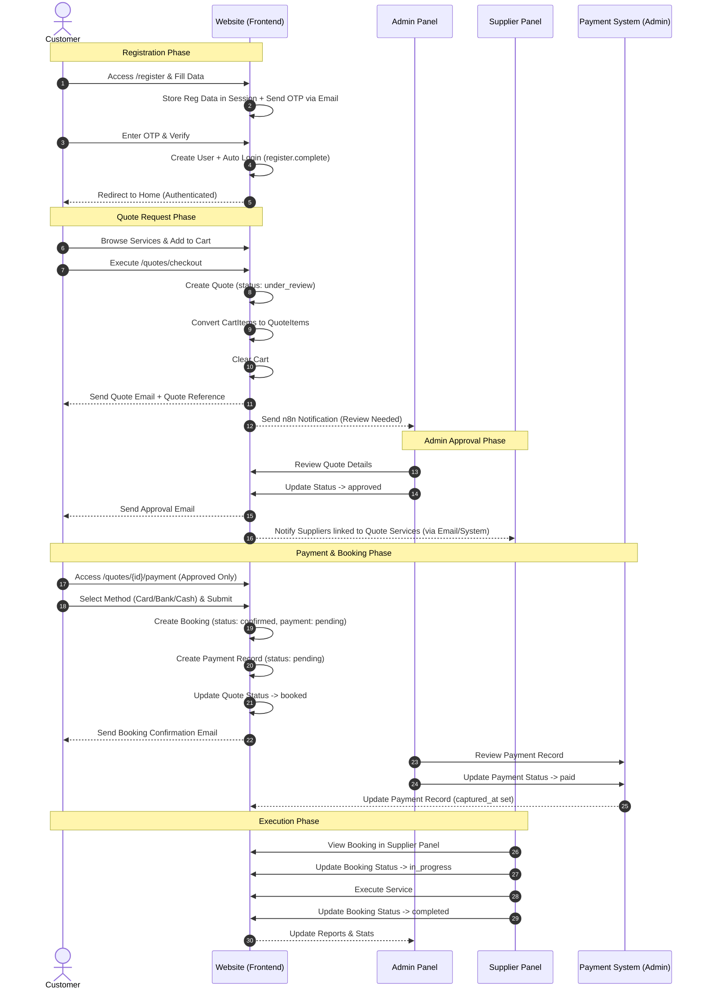
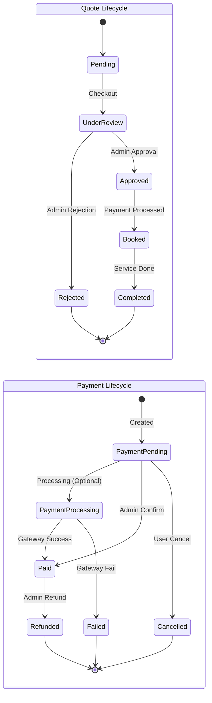

# Your Events - System Diagrams

This document contains Mermaid diagrams describing the system workflows for Customers, Suppliers, and Payments.

## 1. Customer Journey (Registration to Booking Execution)

This sequence diagram illustrates the full flow from a new customer registration, through requesting a quote, admin approval, payment, and finally booking execution.



## 2. Supplier Journey (Registration to Order Fulfillment)

This flowchart describes how a supplier registers, gets approved, and starts receiving and fulfilling orders/bookings.

```mermaid
flowchart TD
    subgraph Registration
        A[Start: Supplier Registration] --> B[Fill Form & Submit]
        B --> C[Receive OTP Email]
        C --> D{Verify OTP}
        D -->|Valid| E[Account Created (Status: Pending)]
        D -->|Invalid| C
    end

    subgraph Approval
        E --> F[Admin Review]
        F -->|Approve| G[Account Active (Status: Approved)]
        F -->|Reject| H[Account Rejected]
        H --> I[End]
    end

    subgraph Onboarding
        G --> J[Supplier Login]
        J --> K[Manage Services]
        K --> L[Update Availability & Prices]
    end

    subgraph Operations
        L --> M{New Approved Quote?}
        M -->|Contains Supplier Service| N[View Quote in Dashboard]
        N --> O{Accept Quote?}
        O -->|Yes (First)| P[Lock Quote (Accepted by Supplier)]
        O -->|No| M
        P --> Q[Receive Booking (Confirmed)]
        Q --> R[Start Execution (In Progress)]
        R --> S[Complete Execution (Completed)]
        S --> T[Revenue Recorded]
    end
```

## 3. Quote & Payment States

State diagram showing the lifecycle of a Quote and its associated Payment.



## Key Technical References

### Customer Flow
- **Registration**: `AuthController::register` -> `OtpController::showVerifyForm` -> `OtpController::completeRegistration`
- **Quote Creation**: `QuoteController::checkout` (Creates Quote from Cart)
- **Payment**: `QuoteController::processPayment` (Creates Booking & Payment records)

### Supplier Flow
- **Registration**: `SupplierController::store` -> `SupplierController::verifyOtp`
- **Dashboard**: `SupplierDashboardController::index`
- **Quote Acceptance**: `SupplierDashboardController::acceptQuote` (Locks quote to supplier)

### Admin Management
- **Quote Approval**: `Admin\QuoteController::updateStatus`
- **Payment Confirmation**: `Admin\PaymentController::updateStatus`
