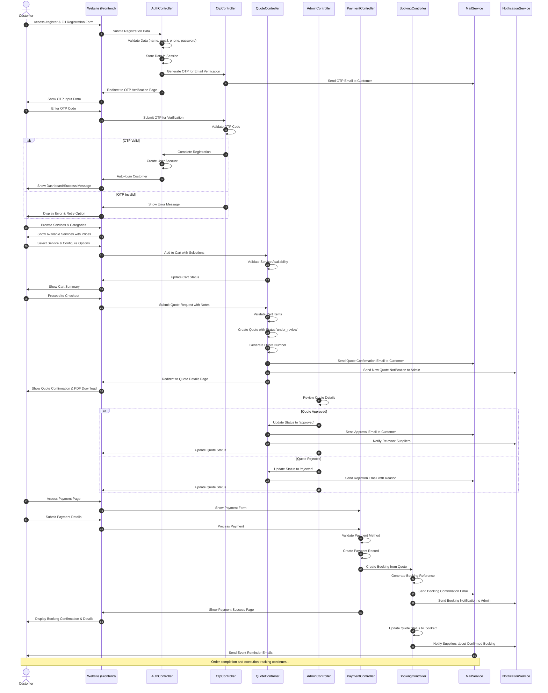
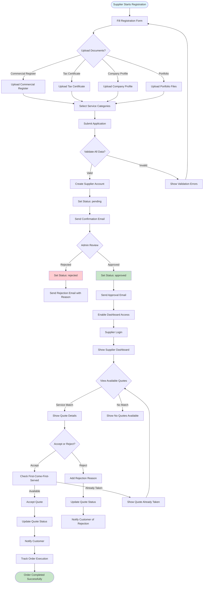
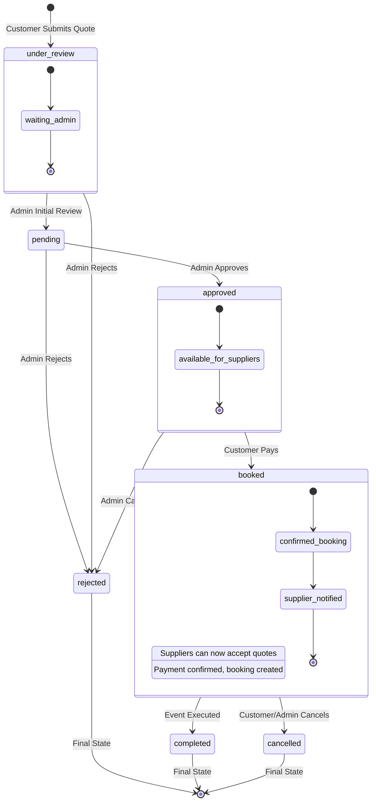
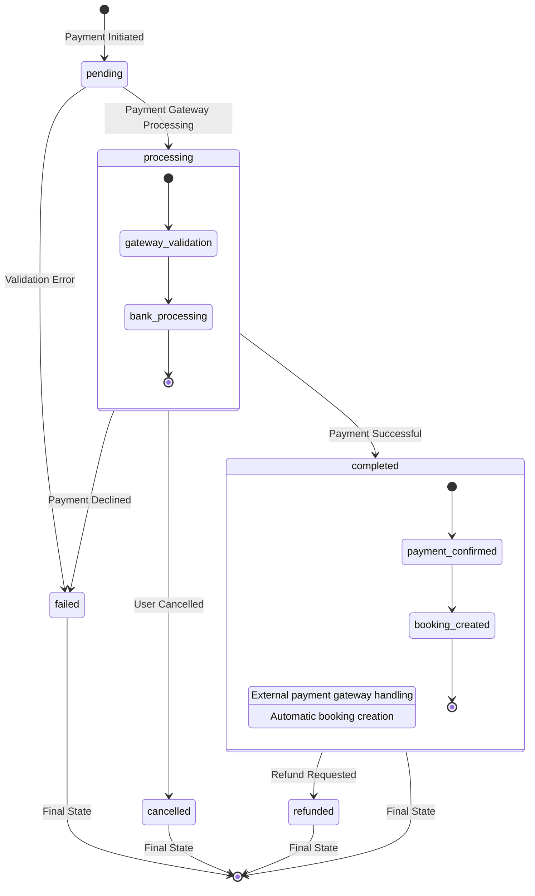

# Your Events - System Workflows & Diagrams

This document contains detailed Mermaid diagrams showing the complete workflows for customers and suppliers in the Your Events platform.

## Customer Journey - Complete Workflow

### Customer Registration to Order Completion (Sequence Diagram)

## Supplier Journey - Complete Workflow

### Supplier Registration to Order Reception (Flow Diagram)

## Quote Lifecycle States

### Quote Status Flow (State Diagram)

## Payment Workflow States

### Payment Status Flow (State Diagram)

## Technical Implementation References

### Customer Registration Flow
- **Registration Form**: `AuthController::register()` - Validates and stores registration data
- **OTP Generation**: `OtpVerification::generate()` - Creates and sends verification code
- **OTP Verification**: `OtpController::completeRegistration()` - Validates OTP and creates account
- **Session Management**: Registration data stored in session between steps

### Quote Management System
- **Quote Creation**: `QuoteController::checkout()` - Converts cart to quote with 'under_review' status
- **Admin Approval**: `Admin\QuoteController::updateStatus()` - Changes quote status and notifies parties
- **Quote Display**: `QuoteController::show()` - Shows quote details to customer
- **PDF Generation**: `QuoteController::downloadPdf()` - Generates downloadable PDF using mPDF

### Payment Processing
- **Payment Form**: `QuoteController::showPayment()` - Displays payment form for approved quotes
- **Payment Processing**: `QuoteController::processPayment()` - Handles payment and creates booking
- **Payment Records**: `Payment::create()` - Creates payment transaction record
- **Booking Creation**: `Booking::create()` - Creates confirmed booking from quote

### Supplier Management
- **Registration**: `SupplierController::store()` - Creates supplier with 'pending' status
- **Admin Review**: `Admin\SupplierController::updateStatus()` - Approves/rejects supplier applications
- **Quote Visibility**: `SupplierDashboardController::quotes()` - Shows relevant quotes to suppliers
- **Quote Acceptance**: `SupplierDashboardController::acceptQuote()` - Handles quote acceptance with first-come-first-served logic

### Key Business Rules
1. **OTP Verification**: Required for all customer registrations and logins
2. **Quote Approval**: Admin must approve quotes before customer can pay
3. **Supplier Filtering**: Suppliers only see quotes containing their services
4. **First-Come-First-Served**: Only one supplier can accept each quote item
5. **Payment Confirmation**: Automatic booking creation upon successful payment
6. **Status Tracking**: Comprehensive status tracking throughout all workflows

### Notification System
- **Email Notifications**: Laravel Mail system for customer and supplier communications
- **Admin Notifications**: n8n integration for WhatsApp and Gmail notifications
- **Real-time Updates**: Session-based flash messages for immediate user feedback

This documentation provides a complete overview of the system workflows, enabling developers to understand the business logic and implement features consistently with existing patterns.