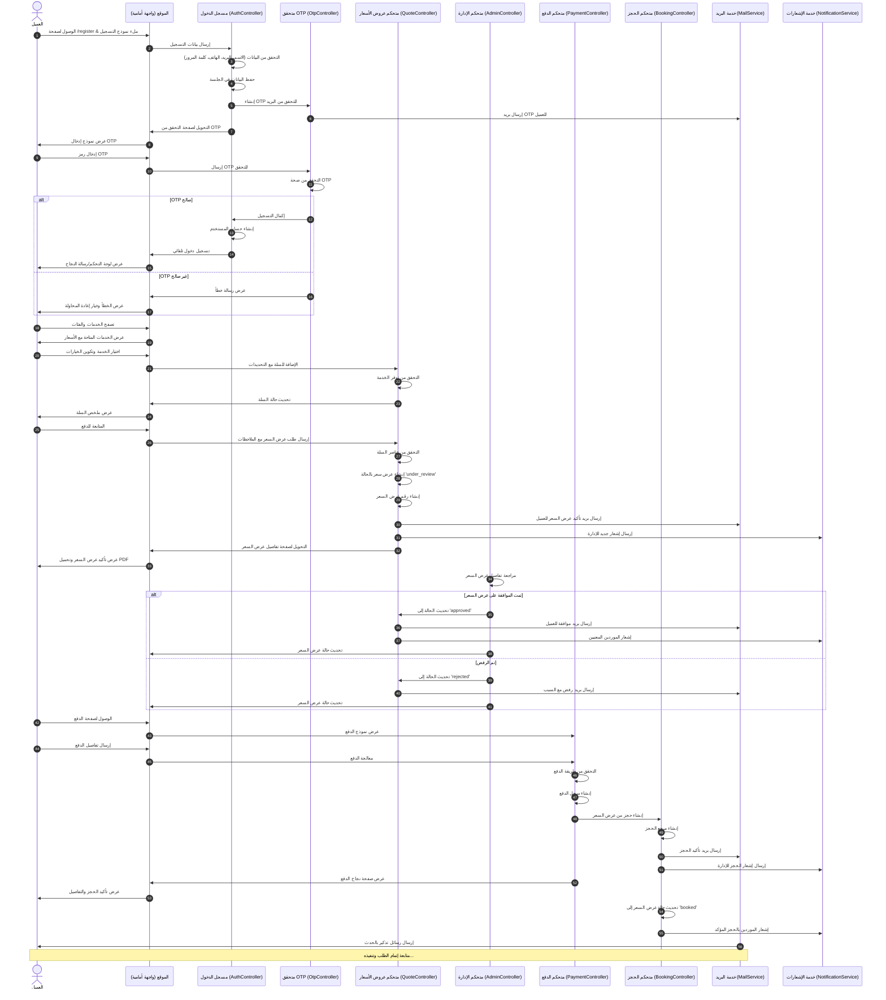
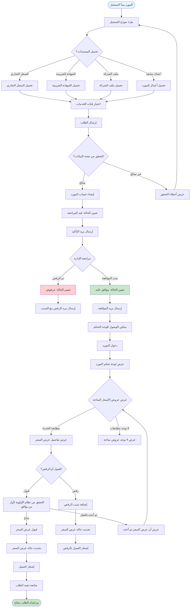
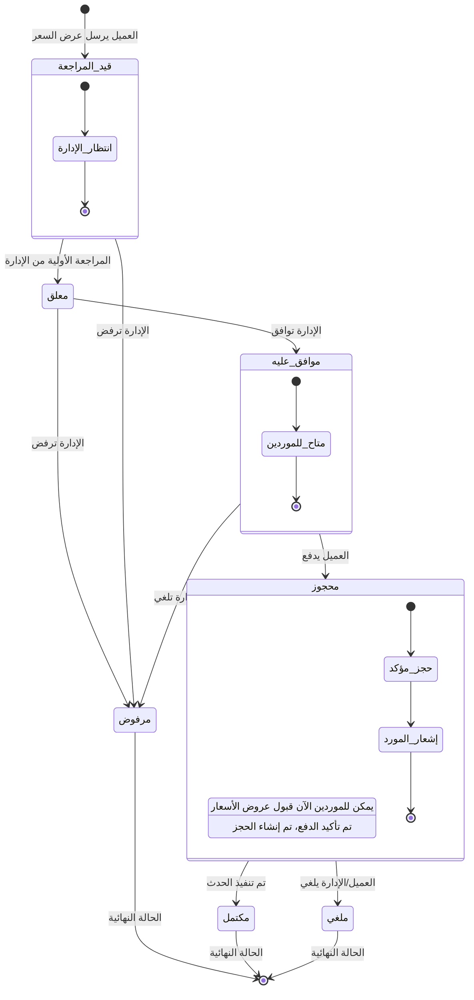
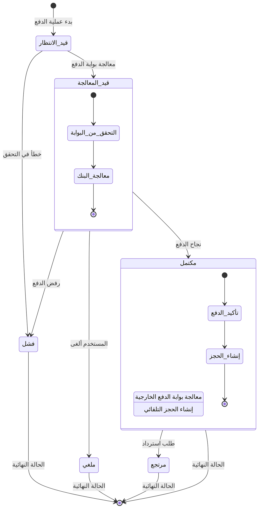

# Your Events - مخططات سير العمل بالعربية

هذا المستند يحتوي على مخططات Mermaid مفصلة توضح سير العمل الكامل للعملاء والموردين في منصة Your Events باللغة العربية.

## رحلة العميل الكاملة

### من التسجيل الأولي حتى إتمام الطلب (مخطط تسلسلي)

## رحلة المورد الكاملة

### من التسجيل حتى استقبال الطلبات (مخطط تدفقي)

## دورة حياة عرض السعر

### تدفق حالات عرض السعر (مخطط الحالات)

## دورة عملية الدفع

### تدفق حالات الدفع (مخطط الحالات)

## المراجع التقنية للتنفيذ

### سير تسجيل العميل
- **نموذج التسجيل**: `AuthController::register()` - يحقق من البيانات ويخزنها
- **إنشاء OTP**: `OtpVerification::generate()` - ينشئ ويرسل رمز التحقق
- **التحقق من OTP**: `OtpController::completeRegistration()` - يحقق من الرمز وينشئ الحساب
- **إدارة الجلسة**: بيانات التسجيل تُخزن في الجلسة بين الخطوات

### نظام إدارة عروض الأسعار
- **إنشاء عرض السعر**: `QuoteController::checkout()` - يحول السلة لعرض سعر بالحالة 'under_review'
- **موافقة الإدارة**: `Admin\QuoteController::updateStatus()` - يغير حالة عرض السعر ويُشعر الأطراف
- **عرض عرض السعر**: `QuoteController::show()` - يعرض تفاصيل عرض السعر للعميل
- **إنشاء PDF**: `QuoteController::downloadPdf()` - ينشئ PDF قابل للتحميل باستخدام mPDF

### معالجة الدفعات
- **نموذج الدفع**: `QuoteController::showPayment()` - يعرض نموذج الدفع للعروض المقبولة
- **معالجة الدفع**: `QuoteController::processPayment()` - يعالج الدفع وينشئ الحجز
- **سجلات الدفع**: `Payment::create()` - ينشئ سجل معاملة الدفع
- **إنشاء الحجز**: `Booking::create()` - ينشئ حجز مؤكد من عرض السعر

### إدارة الموردين
- **التسجيل**: `SupplierController::store()` - ينشئ مورد بالحالة 'pending'
- **مراجعة الإدارة**: `Admin\SupplierController::updateStatus()` - يقبل/يرفض طلبات الموردين
- **رؤية عروض الأسعار**: `SupplierDashboardController::quotes()` - يعرض عروض الأسعار ذات الصلة للموردين
- **قبول عرض السعر**: `SupplierDashboardController::acceptQuote()` - يعالج قبول عرض السعر بنظام الأولوية

### القواعد التجارية الرئيسية
1. **التحقق بـOTP**: مطلوب لجميع تسجيلات العملاء وتسجيلات الدخول
2. **موافقة عرض السعر**: يجب أن توافق الإدارة على عروض الأسعار قبل أن يتمكن العميل من الدفع
3. **تصفية الموردين**: الموردون يرون فقط عروض الأسعار التي تحتوي على خدماتهم
4. **الأولوية لأول من يوافق**: مورد واحد فقط يمكنه قبول كل عنصر في عرض السعر
5. **تأكيد الدفع**: إنشاء الحجز التلقائي عند نجاح الدفع
6. **تتبع الحالات**: تتبع شامل للحالات خلال جميع سير العمل

### نظام الإشعارات
- **إشعارات البريد**: نظام Laravel Mail للتواصل مع العملاء والموردين
- **إشعارات الإدارة**: تكامل مع n8n لإشعارات WhatsApp والبريد الجيميل
- **تحديثات فورية**: رسائل فلاش قائمة على الجلسة للتغذية الراجعة الفورية

هذا التوثيق يوفر نظرة شاملة على سير العمل في النظام، مما يمكن المطورين من فهم المنطق التجاري وتنفيذ الميزات بشكل متسق مع الأنماط الموجودة.